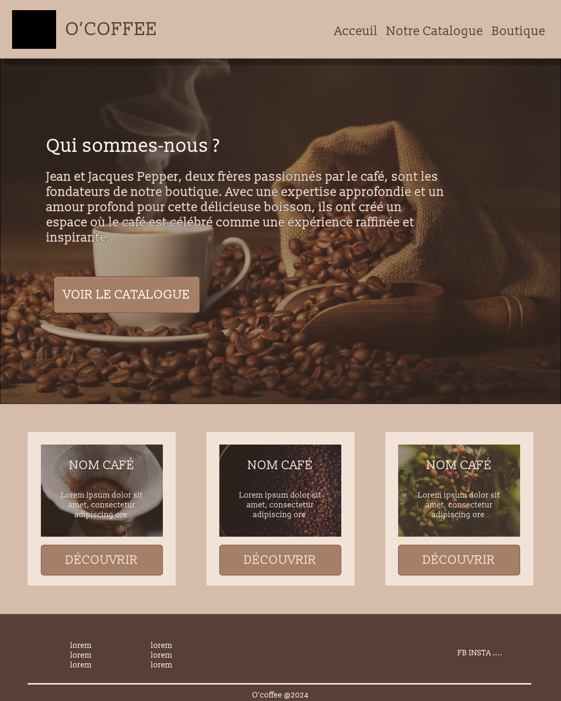
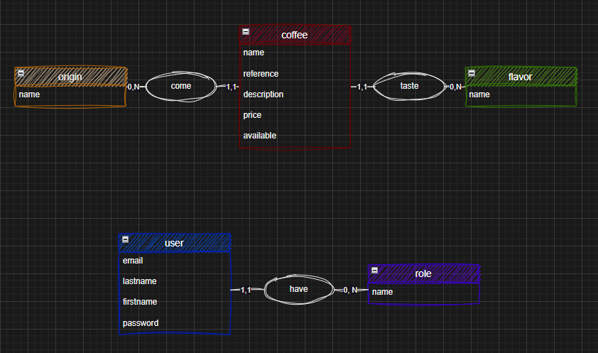
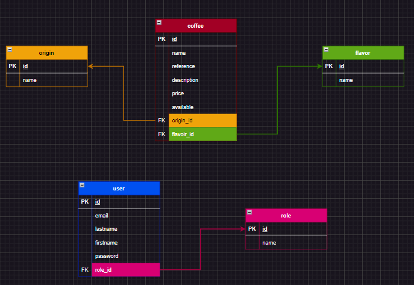

# O'**Coffee**

## Information du projet

[Le projet](./docs/demande-client/)

## Remarques pédagogiques et rendus

[Recommandations](./docs/recommandations/)

## Lien kanban projet
[Kanban](https://github.com/orgs/O-clock-Sigyn/projects/2/views/1)

## Demande client
[cdc & user-story](./docs/demande-client/user-stories.md)

## Maquette

Maquette

## Gestion BDD

### 1. MCD & MLD

## Mise en place du server
- Penser à `npm install` les dépendances
- configurer vos accès avec `.env.example` pour votre `.env`
- lancer le mode developpement `npm run dev`

---

### Un problème ?
- #### [consulter issue](https://github.com/O-clock-Sigyn/soutien-ateliers/issues)
- #### [nouvelle issue](https://github.com/O-clock-Sigyn/soutien-ateliers/issues/new/choose)
